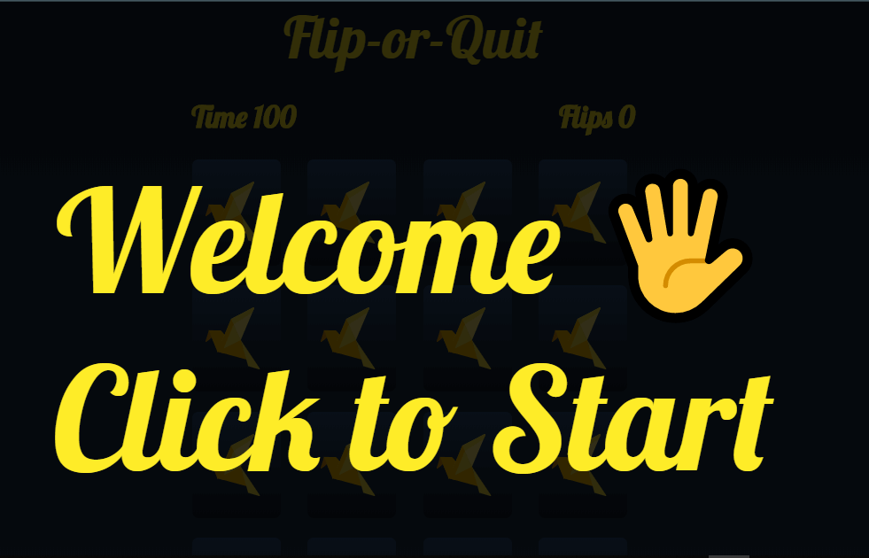
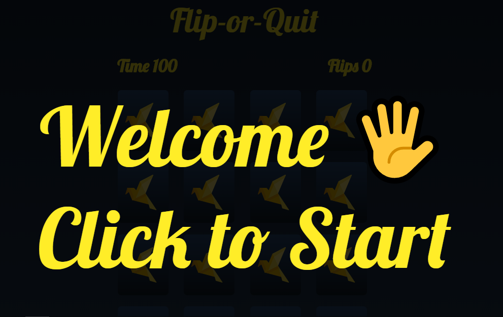
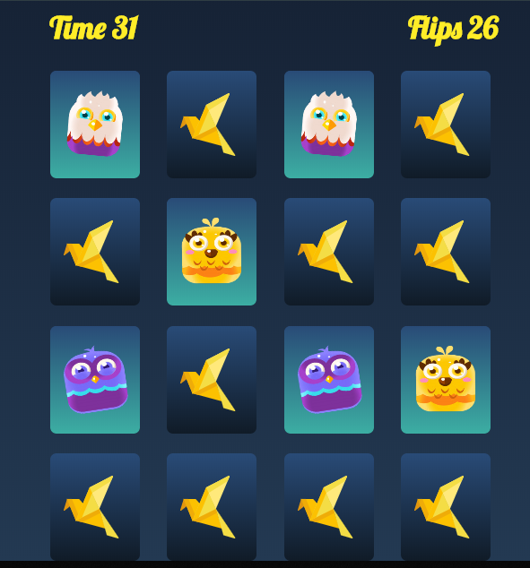
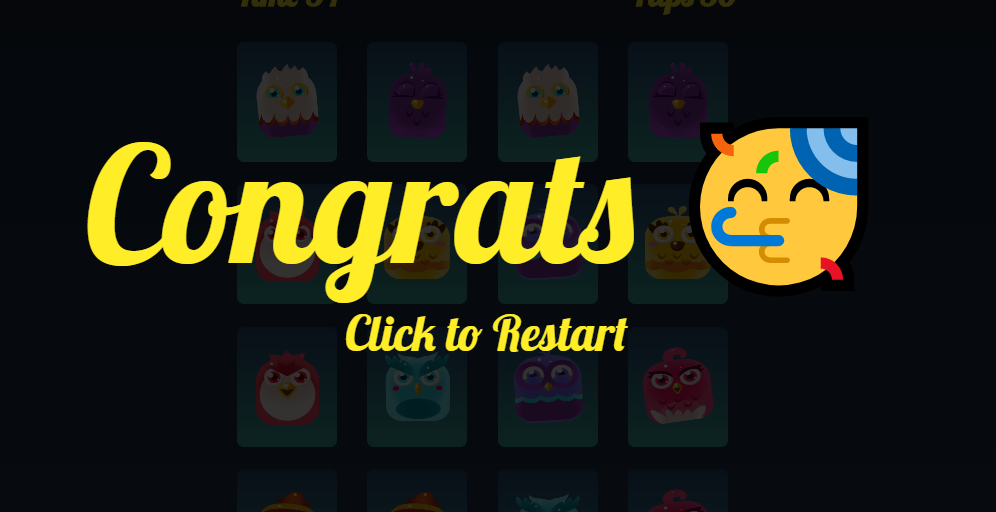
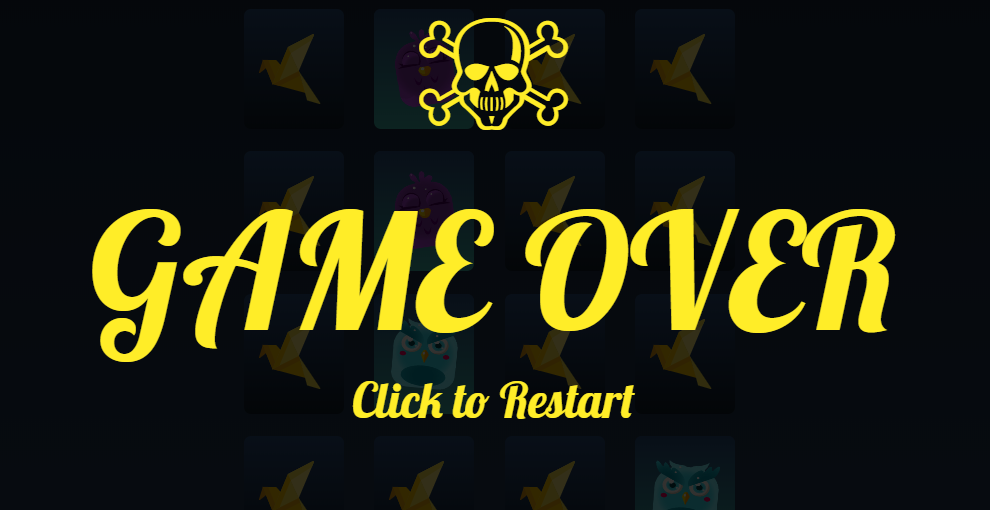

 

## 🔍 **About** ([play here](https://adelrizq.github.io/Flip-or-Quit/))

🃏 Matching cards game that developed with HTML, CSS, JS with OOP.

## 📽 **Demo**

    

---

## 📷 **ScreenShots** 

  

--- 

## 👏 TODO:
- [ ] add different themes.

---

## 👬 **Contributing**

> Contributions are what make the open source community such an amazing place to be learn, inspire, and create. Any contributions you make are **greatly appreciated**.

Check out our [contributing guidelines](https://github.com/AdelRizq/Flip-or-Quit) for ways to contribute.

 
## 📜 **License**

> This project is licensed under MIT License, See [License](https://github.com/AdelRizq/Flip-or-Quit) for more information ©AdelRizq.
